# Arentのcoding-challenge

## プロジェクト
### Project

Food Trucks
### Technical spec
バックエンド対応のみ

#### Back-end

- 言語: PHP
- Framework: Laravel (Laravel で動かすが将来的にフレームワークの変更を柔軟にできるように DDD & Layered architecture で開発)
  - DDD & Layered architecture
    - Application Layer フォルダ: server/packages/CodingChallenge/Application
    - Domain Layer フォルダ: server/packages/CodingChallenge/Domain
    - Infrastructure Layer フォルダ: server/packages/CodingChallenge/Infrastructure
- Technical:
  - Docker (ローカル開発)
  - Google Maps API (住所から軽度緯度取得するために利用)
  - Git + Github
- Git フロー

#### アルゴリズム
1. [提供されているAPI](https://data.sfgov.org/Economy-and-Community/Mobile-Food-Facility-Permit/rqzj-sfat) からFood Truckを取得する (住所、軽度、緯度があるものだけ)
2. 指定された住所をGoogle Maps API に問い合わせして、軽度緯度を取得する。
3. 取得できた軽度緯度から近くのFood Trucksを算出する。

## API Documentation

編集された内容は `coding-challenge.v1.yaml` として保存されるので redoc-cli で静的ファイルを生成した後 CI で S3 bucket にアップロードする。(CI & S3 は未実装)
Docs は [こちら](docs/README.md) です。

## 基盤
AWSのEC2に載せる予定。

## 残り作業、改善点
- API Docs をS3にアップして、公開する
- API Applicationをサーバーに載せる。
- FE 作業
- ユニットテスト
- API の認証
- CI/CD

## リソース
- https://data.sfgov.org/Economy-and-Community/Mobile-Food-Facility-Permit/rqzj-sfat
- https://developers.google.com/maps/documentation/geocoding/overview
- https://laravel.com/

## Profile
- [Linkedin](https://www.linkedin.com/in/duc-nguyen-huu-84193213a)
- [Viblo blog](https://viblo.asia/u/ducxomme)
